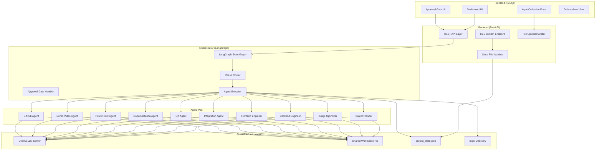
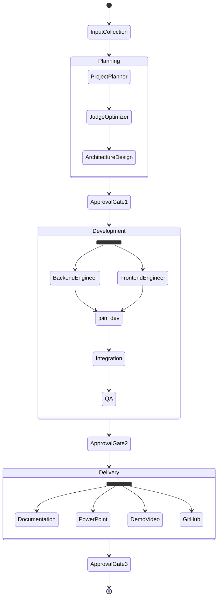

# Design Document: Hackathon Studio

## Overview

Hackathon Studio is an autonomous multi-agent AI software studio that transforms hackathon inputs (brief, rubric, idea, tech stack) into a complete hackathon-ready MVP. The system orchestrates 10 specialized agents through three phases—Planning, Development, Delivery—using LangGraph for state-machine-based coordination and Ollama for local LLM inference (no cloud API keys required).

The architecture follows a hub-and-spoke model: a central FastAPI backend serves as the orchestration layer, coordinating agents via LangGraph's state graph. A Next.js frontend provides real-time monitoring via Server-Sent Events (SSE). All agents share a unified file-based workspace and communicate progress through a centralized `project_state.json` file.

### Key Design Decisions

| Decision | Choice | Rationale |
|----------|--------|-----------|
| LLM Provider | Ollama (local) | No API keys needed; full privacy; configurable model selection |
| Agent Orchestration | LangGraph | State-machine semantics; conditional edges; parallel execution support |
| Real-time Updates | SSE (Server-Sent Events) | One-way server-to-client; simpler than WebSockets for status streaming |
| Inter-agent Communication | File-based shared workspace | Simple, inspectable, supports parallel reads; agents are decoupled |
| Presentation Generation | python-pptx | Industrial-grade PPTX generation without PowerPoint installed |
| Demo Recording | Playwright + FFmpeg | Playwright captures browser sessions; FFmpeg encodes final video |
| State Tracking | project_state.json | Single source of truth for all agent statuses; atomic file writes |

## Architecture

### System Architecture Diagram



### Workflow Phase Diagram



### Directory Structure

```
hackathon-studio/
├── backend/                     # FastAPI backend + orchestration
│   ├── app/
│   │   ├── main.py             # FastAPI application entry point
│   │   ├── api/
│   │   │   ├── routes/
│   │   │   │   ├── inputs.py   # Input collection endpoints
│   │   │   │   ├── workflow.py # Workflow control endpoints
│   │   │   │   ├── approval.py # Approval gate endpoints
│   │   │   │   └── stream.py  # SSE streaming endpoint
│   │   │   └── deps.py        # Shared dependencies
│   │   ├── orchestrator/
│   │   │   ├── graph.py        # LangGraph state graph definition
│   │   │   ├── state.py        # Graph state schema
│   │   │   ├── nodes.py        # Graph node functions
│   │   │   └── edges.py       # Conditional edge logic
│   │   ├── agents/
│   │   │   ├── base.py         # Base agent class with Ollama integration
│   │   │   ├── project_planner.py
│   │   │   ├── judge_optimizer.py
│   │   │   ├── backend_engineer.py
│   │   │   ├── frontend_engineer.py
│   │   │   ├── integration.py
│   │   │   ├── qa.py
│   │   │   ├── documentation.py
│   │   │   ├── powerpoint.py
│   │   │   ├── demo_video.py
│   │   │   └── github.py
│   │   ├── services/
│   │   │   ├── ollama_client.py  # Ollama API wrapper with retry logic
│   │   │   ├── workspace.py     # Shared workspace file operations
│   │   │   ├── state_manager.py # project_state.json manager
│   │   │   └── validators.py   # Artifact validation logic
│   │   └── models/
│   │       ├── project_state.py # Pydantic models for state
│   │       ├── inputs.py       # Input validation models
│   │       └── artifacts.py    # Artifact metadata models
│   ├── requirements.txt
│   └── tests/
│       ├── test_agents/
│       ├── test_orchestrator/
│       └── test_services/
├── frontend/                    # Next.js dashboard
│   ├── src/
│   │   ├── app/
│   │   │   ├── page.tsx        # Main dashboard
│   │   │   ├── input/page.tsx  # Input collection page
│   │   │   ├── monitor/page.tsx # Agent monitoring page
│   │   │   ├── approval/page.tsx # Approval gate page
│   │   │   └── deliverables/page.tsx # Final deliverables
│   │   ├── components/
│   │   │   ├── agent-status-card.tsx
│   │   │   ├── phase-indicator.tsx
│   │   │   ├── log-viewer.tsx
│   │   │   ├── file-upload.tsx
│   │   │   └── approval-dialog.tsx
│   │   ├── hooks/
│   │   │   ├── use-sse.ts      # SSE connection hook
│   │   │   └── use-project-state.ts
│   │   └── lib/
│   │       ├── api.ts          # API client
│   │       └── types.ts        # TypeScript types
│   ├── package.json
│   └── tailwind.config.ts
└── shared_workspace/            # Runtime workspace (created per project)
    ├── inputs/                  # Uploaded input files
    ├── project_spec.md
    ├── judge_analysis.md
    ├── architecture.md
    ├── roadmap.md
    ├── backend/                 # Generated backend code
    ├── frontend/               # Generated frontend code
    ├── docs/
    ├── ppt/
    ├── video/
    ├── logs/
    │   ├── failures.log
    │   └── agent_*.log
    └── project_state.json
```

## Components and Interfaces

### 1. Ollama Client Service

The Ollama client wraps the local Ollama HTTP API, providing retry logic, timeout handling, and model selection.

```python
class OllamaClient:
    """Wrapper for Ollama's local API with retry and fallback logic."""

    def __init__(
        self,
        base_url: str = "http://localhost:11434",
        model: str = "llama3",
        timeout: float = 120.0,
        max_retries: int = 3,
        retry_delay: float = 2.0,
    ): ...

    async def generate(self, prompt: str, system: str | None = None) -> str:
        """Generate text completion with retry logic."""
        ...

    async def chat(self, messages: list[dict], system: str | None = None) -> str:
        """Chat completion with retry logic."""
        ...

    async def health_check(self) -> bool:
        """Check if Ollama server is responsive."""
        ...
```

### 2. Base Agent Interface

All agents inherit from a common base class providing LLM access, workspace operations, and state management.

```python
class BaseAgent(ABC):
    """Base class for all Hackathon Studio agents."""

    def __init__(
        self,
        agent_name: str,
        ollama_client: OllamaClient,
        workspace: WorkspaceService,
        state_manager: StateManager,
    ): ...

    @abstractmethod
    async def execute(self, context: dict) -> AgentResult:
        """Execute the agent's primary task. Must be implemented by subclasses."""
        ...

    async def read_artifact(self, path: str) -> str:
        """Read an artifact from the shared workspace with state validation."""
        ...

    async def write_artifact(self, path: str, content: str) -> None:
        """Write an artifact to the shared workspace."""
        ...

    async def llm_generate(self, prompt: str, system: str | None = None) -> str:
        """Generate LLM response via Ollama with agent-specific system prompt."""
        ...

    async def update_status(self, status: AgentStatus) -> None:
        """Update this agent's status in project_state.json."""
        ...
```

### 3. LangGraph Orchestrator

The orchestrator defines the state graph that drives the entire workflow.

```python
from langgraph.graph import StateGraph, END
from langchain_ollama import ChatOllama

class OrchestratorState(TypedDict):
    phase: str  # "planning" | "development" | "delivery" | "complete"
    agents_status: dict[str, str]
    approval_pending: bool
    approval_gate: int  # 1, 2, or 3
    error: str | None
    revision_count: int

def build_orchestrator_graph() -> StateGraph:
    """Build the LangGraph state machine for workflow orchestration."""
    graph = StateGraph(OrchestratorState)

    # Add nodes for each workflow step
    graph.add_node("project_planning", run_project_planner)
    graph.add_node("judge_optimization", run_judge_optimizer)
    graph.add_node("architecture_design", run_architecture_design)
    graph.add_node("approval_gate_1", handle_approval_gate)
    graph.add_node("parallel_development", run_parallel_development)
    graph.add_node("integration", run_integration)
    graph.add_node("qa_testing", run_qa)
    graph.add_node("approval_gate_2", handle_approval_gate)
    graph.add_node("parallel_delivery", run_parallel_delivery)
    graph.add_node("approval_gate_3", handle_approval_gate)

    # Add edges with conditional routing
    graph.add_edge("project_planning", "judge_optimization")
    graph.add_edge("judge_optimization", "architecture_design")
    graph.add_edge("architecture_design", "approval_gate_1")
    graph.add_conditional_edges("approval_gate_1", route_after_approval)
    graph.add_edge("parallel_development", "integration")
    graph.add_edge("integration", "qa_testing")
    graph.add_conditional_edges("qa_testing", route_after_qa)
    graph.add_conditional_edges("approval_gate_2", route_after_approval)
    graph.add_edge("parallel_delivery", "approval_gate_3")
    graph.add_conditional_edges("approval_gate_3", route_after_approval)

    graph.set_entry_point("project_planning")
    return graph.compile()
```

### 4. State Manager

Handles atomic reads/writes to `project_state.json` with file locking.

```python
class StateManager:
    """Manages project_state.json with atomic file operations."""

    async def read_state(self) -> ProjectState: ...
    async def update_agent_status(self, agent: str, status: str) -> None: ...
    async def set_phase(self, phase: str) -> None: ...
    async def get_agent_status(self, agent: str) -> str: ...
    async def is_artifact_ready(self, artifact_path: str, producing_agent: str) -> bool: ...
```

### 5. Workspace Service

Manages the shared file system workspace.

```python
class WorkspaceService:
    """File operations for the shared workspace."""

    def __init__(self, workspace_root: Path): ...

    async def write_file(self, relative_path: str, content: str | bytes) -> None: ...
    async def read_file(self, relative_path: str) -> str: ...
    async def file_exists(self, relative_path: str) -> bool: ...
    async def validate_artifact(self, relative_path: str, validator: ArtifactValidator) -> ValidationResult: ...
    async def list_files(self, directory: str) -> list[str]: ...
```

### 6. FastAPI Endpoints

```python
# Input Collection
POST /api/inputs/upload          # Upload hackathon brief, rubric
POST /api/inputs/submit          # Submit project idea + tech stack
GET  /api/inputs/status          # Get validation status

# Workflow Control
POST /api/workflow/start          # Start the orchestration pipeline
GET  /api/workflow/state          # Get current project state
POST /api/workflow/approve        # Approve at approval gate
POST /api/workflow/request-change # Request revision at gate

# Streaming
GET  /api/stream/status          # SSE endpoint for real-time updates
GET  /api/stream/logs/{agent}    # SSE endpoint for agent logs

# Deliverables
GET  /api/deliverables           # List all generated artifacts
GET  /api/deliverables/{path}    # Download specific artifact
```

### 7. Artifact Validators

```python
class ArtifactValidator(ABC):
    @abstractmethod
    async def validate(self, file_path: Path) -> ValidationResult: ...

class PythonSyntaxValidator(ArtifactValidator): ...
class PackageJsonValidator(ArtifactValidator): ...
class PptxValidator(ArtifactValidator): ...
class Mp4Validator(ArtifactValidator): ...
class MarkdownNonEmptyValidator(ArtifactValidator): ...
```

## Data Models

### Project State Schema

```python
from pydantic import BaseModel
from enum import Enum
from datetime import datetime

class AgentStatus(str, Enum):
    PENDING = "pending"
    IN_PROGRESS = "in_progress"
    COMPLETED = "completed"
    FAILED = "failed"

class PhaseStatus(str, Enum):
    PLANNING = "planning"
    DEVELOPMENT = "development"
    DELIVERY = "delivery"
    COMPLETE = "complete"

class AgentPhase(BaseModel):
    status: AgentStatus
    started_at: datetime | None = None
    completed_at: datetime | None = None
    error: str | None = None

class ApprovalGateState(BaseModel):
    gate_number: int
    pending: bool = False
    revision_count: int = 0
    feedback: str | None = None

class ProjectState(BaseModel):
    phase: PhaseStatus
    agents: dict[str, AgentPhase]
    approval_gates: dict[int, ApprovalGateState]
    created_at: datetime
    updated_at: datetime
```

### Input Models

```python
class InputPackage(BaseModel):
    hackathon_brief: UploadedFile  # PDF, DOCX, or TXT, max 10MB
    judging_rubric: UploadedFile   # PDF, DOCX, or TXT, max 10MB
    project_idea: str              # 1-5000 characters
    tech_stack: str | None = None  # Optional, max 2000 characters

class UploadedFile(BaseModel):
    filename: str
    content_type: str  # "application/pdf" | "application/vnd.openxmlformats..." | "text/plain"
    size: int          # Max 10MB (10_485_760 bytes)
    extracted_text: str

class ValidationResult(BaseModel):
    valid: bool
    errors: list[ValidationError]

class ValidationError(BaseModel):
    field: str
    reason: str  # "unsupported_format" | "empty_content" | "unextractable_text" | "size_exceeded" | "length_constraint"
    detail: str
```

### Agent Result Models

```python
class AgentResult(BaseModel):
    agent_name: str
    success: bool
    artifacts_produced: list[str]  # Relative paths in workspace
    error: str | None = None
    duration_seconds: float

class OrchestratorEvent(BaseModel):
    timestamp: datetime
    event_type: str  # "status_change" | "phase_change" | "approval_required" | "error" | "complete"
    agent: str | None = None
    data: dict
```

### Ollama Configuration

```python
class OllamaConfig(BaseModel):
    base_url: str = "http://localhost:11434"
    model: str = "llama3"
    timeout_seconds: float = 120.0
    max_retries: int = 3
    retry_delay_seconds: float = 2.0
    temperature: float = 0.7
    context_window: int = 8192
```


## Correctness Properties

*A property is a characteristic or behavior that should hold true across all valid executions of a system—essentially, a formal statement about what the system should do. Properties serve as the bridge between human-readable specifications and machine-verifiable correctness guarantees.*

### Property 1: Input Validation Correctness

*For any* uploaded file with a given format and size, and any text input with a given length, the input validator SHALL accept the input if and only if: (a) the file format is one of PDF, DOCX, or TXT, (b) the file size is ≤ 10MB and > 0 bytes, (c) text content is extractable and non-empty, and (d) text length constraints are met (1-5000 for project idea, 0-2000 for optional tech stack).

**Validates: Requirements 1.1, 1.2, 1.3, 1.4, 1.5**

### Property 2: Validation Error Reporting Completeness

*For any* input that fails validation, the resulting error message SHALL contain both the field/document name that failed and the specific reason for failure (one of: unsupported_format, empty_content, unextractable_text, size_exceeded, length_constraint).

**Validates: Requirements 1.6**

### Property 3: Agent State Transition on Success

*For any* agent that completes execution and produces valid artifacts, the state manager SHALL transition that agent's status from "in_progress" to "completed" and record a completion timestamp, and the previous status SHALL have been "in_progress".

**Validates: Requirements 2.4, 3.5, 14.1**

### Property 4: Agent State Transition on Failure

*For any* agent that fails during execution, the state manager SHALL transition that agent's status to "failed", record the error message, log the failure to logs/failures.log with a timestamp, and the error field SHALL be non-empty.

**Validates: Requirements 2.5, 3.6, 4.6, 14.5, 16.6**

### Property 5: Score Threshold Improvement Suggestions

*For any* set of criterion scores, the Judge_Optimizer_Agent's suggestion filter SHALL produce improvement suggestions for exactly those criteria with scores below 8, and SHALL produce zero suggestions for criteria scoring 8 or above.

**Validates: Requirements 3.3**

### Property 6: Document Structure Validation

*For any* generated markdown document (project_spec.md, judge_analysis.md, architecture.md, roadmap.md, README.md, developer_guide.md, api_docs.md), the structure validator SHALL pass if and only if all required sections for that document type are present and each section contains at least one non-whitespace character.

**Validates: Requirements 2.1, 3.4, 4.2, 4.3, 10.1, 10.2, 10.3**

### Property 7: Technology Reference Containment

*For any* architecture document and a defined set of allowed technologies, the technology validator SHALL reject the document if it references any technology not present in the allowed set, and SHALL accept it if all referenced technologies are within the allowed set.

**Validates: Requirements 4.4**

### Property 8: Approval Gate Execution Blocking

*For any* orchestrator state where an approval gate is pending, no agent SHALL transition from "pending" to "in_progress" until the approval gate's pending flag is cleared.

**Validates: Requirements 5.1**

### Property 9: Revision Counter Bounds

*For any* sequence of revision requests at an approval gate, the revision counter SHALL increment by exactly 1 per request and SHALL not exceed 5. When the counter reaches 5, the system SHALL escalate rather than accept further revision requests.

**Validates: Requirements 5.4**

### Property 10: Parallel Execution Fault Isolation

*For any* set of agents executing in parallel, if one agent transitions to "failed" status, all other concurrently running agents SHALL remain in their current status (either "in_progress" or "completed") and SHALL not be affected by the failure.

**Validates: Requirements 14.2, 14.3**

### Property 11: Artifact Access Control

*For any* agent attempting to read an artifact from the shared workspace, the read SHALL succeed if and only if the producing agent's status is "completed" in the project state. If the producing agent's status is anything other than "completed", the read SHALL be denied.

**Validates: Requirements 14.4**

### Property 12: Agent Write Protection

*For any* write operation to the shared workspace, the write SHALL be permitted only if the target path is within the writing agent's designated output directory. Writes to paths owned by other agents SHALL be rejected unless an explicit dependency justification is provided.

**Validates: Requirements 14.6**

### Property 13: Artifact Format Validation Dispatch

*For any* completed agent, the orchestrator SHALL apply the correct format-specific validator: Python syntax check and requirements.txt validation for backend, package.json schema validation for frontend, OOXML structure and slide count (≥6) validation for PPTX, and video stream presence with duration (≥5s) validation for MP4. Each artifact must also have file size > 0 bytes.

**Validates: Requirements 16.1, 16.2, 16.3, 16.4, 16.5**

## Error Handling

### Error Categories and Strategies

| Category | Examples | Strategy |
|----------|----------|----------|
| Ollama Unavailable | Server down, timeout | Retry with exponential backoff (3 retries, 2s/4s/8s delay). If all fail, mark agent as failed, notify user. |
| Ollama Slow Response | High latency, partial response | Per-call timeout of 120s. Retry once with reduced prompt length. |
| Agent Timeout | Agent exceeds 600s | Terminate agent, mark phase failed, log timeout error. |
| Invalid LLM Output | Malformed JSON, missing sections | Retry generation with more explicit prompting (up to 2 retries). If still invalid, mark failed. |
| File System Error | Disk full, permission denied | Immediate failure, log error, notify user. No retry (likely systemic). |
| Input Validation Error | Bad format, oversized file | Return specific error to user with field name and reason. No retry needed. |
| Artifact Validation Failure | Empty file, malformed PPTX | Mark agent failed, log validation error details. |
| GitHub API Error | Auth failure, rate limit, conflict | Retry up to 3 times with 5s delay. If all fail, mark failed and notify. |
| Approval Gate Timeout | User doesn't respond | System remains paused indefinitely (no auto-timeout on human gates). |

### Ollama Retry Logic

```python
async def call_with_retry(self, prompt: str) -> str:
    for attempt in range(self.max_retries):
        try:
            response = await asyncio.wait_for(
                self._call_ollama(prompt),
                timeout=self.timeout_seconds
            )
            return response
        except (asyncio.TimeoutError, ConnectionError) as e:
            if attempt == self.max_retries - 1:
                raise OllamaUnavailableError(f"Ollama failed after {self.max_retries} attempts: {e}")
            delay = self.retry_delay * (2 ** attempt)  # Exponential backoff
            await asyncio.sleep(delay)
```

### Agent Failure Propagation

When an agent fails:
1. Agent's `execute()` raises or returns failure result
2. Orchestrator catches failure in the LangGraph node
3. State manager atomically updates agent status to "failed" with error message
4. Failure is logged to `logs/failures.log` with timestamp
5. SSE event is emitted to frontend within 10 seconds
6. If in parallel phase: other agents continue unaffected
7. If in sequential phase: workflow halts and user is notified

### Graceful Degradation

- If PowerPoint generation fails, other delivery agents still complete
- If Demo Video fails (app won't start), other deliverables are still produced
- If GitHub push fails, all other artifacts remain available for manual download
- Documentation agent generates content from available artifacts, noting missing sources

## Testing Strategy

### Testing Framework Selection

| Layer | Framework | Purpose |
|-------|-----------|---------|
| Backend Unit Tests | Pytest | Agent logic, validators, state management |
| Backend Property Tests | Hypothesis (pytest plugin) | Input validation, state transitions, validators |
| Frontend Unit Tests | Vitest | Component rendering, hooks, utilities |
| Integration Tests | Pytest + httpx | API endpoints, workflow sequences |
| UI Tests | Playwright | End-to-end user flows, dashboard |
| Contract Tests | Pytest | Agent output structure validation |

### Property-Based Testing Configuration

- Library: **Hypothesis** (Python) for backend property tests
- Minimum iterations: **100** per property test
- Each property test references its design document property
- Tag format: `Feature: hackathon-studio, Property {number}: {property_text}`

### Dual Testing Approach

**Unit Tests** cover:
- Specific examples demonstrating correct behavior
- Integration points between orchestrator and agents
- Edge cases (empty inputs, boundary values, timeout scenarios)
- Error conditions and failure paths

**Property Tests** cover:
- Input validation across the full input space (formats, sizes, lengths)
- State machine transition correctness for all valid state sequences
- Artifact validation logic with generated test data
- Access control and write protection invariants
- Approval gate counter arithmetic

### Test Organization

```
backend/tests/
├── unit/
│   ├── test_ollama_client.py       # Timeout, retry behavior
│   ├── test_state_manager.py       # CRUD operations, atomic updates
│   ├── test_workspace.py           # File operations
│   └── test_agents/                # Individual agent logic
├── property/
│   ├── test_input_validation.py    # Properties 1, 2
│   ├── test_state_transitions.py   # Properties 3, 4, 8
│   ├── test_score_filtering.py     # Property 5
│   ├── test_document_validation.py # Property 6
│   ├── test_tech_validation.py     # Property 7
│   ├── test_revision_counter.py    # Property 9
│   ├── test_fault_isolation.py     # Property 10
│   ├── test_access_control.py      # Properties 11, 12
│   └── test_artifact_validators.py # Property 13
├── integration/
│   ├── test_api_endpoints.py
│   ├── test_workflow_sequence.py
│   └── test_sse_streaming.py
└── conftest.py                     # Shared fixtures, Hypothesis profiles

frontend/
├── __tests__/
│   ├── components/                 # Vitest component tests
│   └── hooks/                      # Hook unit tests
└── e2e/
    ├── input-collection.spec.ts    # Playwright
    ├── monitoring.spec.ts
    └── approval-gates.spec.ts
```

### Key Test Scenarios

1. **Input Validation** (Property Tests): Random file formats, sizes, text lengths; boundary conditions at exactly 10MB, 0 chars, 5000 chars, 2000 chars
2. **State Machine** (Property Tests): Random sequences of agent completions/failures; concurrent state updates; gate triggers
3. **Artifact Validators** (Property Tests): Random file structures, missing fields, malformed data
4. **Ollama Integration** (Unit Tests): Mock server responses, timeout simulation, retry counting
5. **Workflow E2E** (Integration Tests): Full pipeline with mocked Ollama responses
6. **Dashboard** (Playwright): Input submission, progress monitoring, approval interaction, deliverables download
